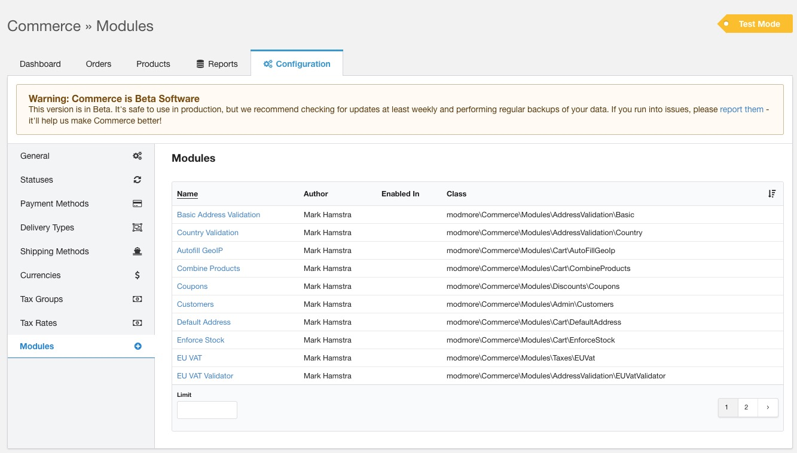
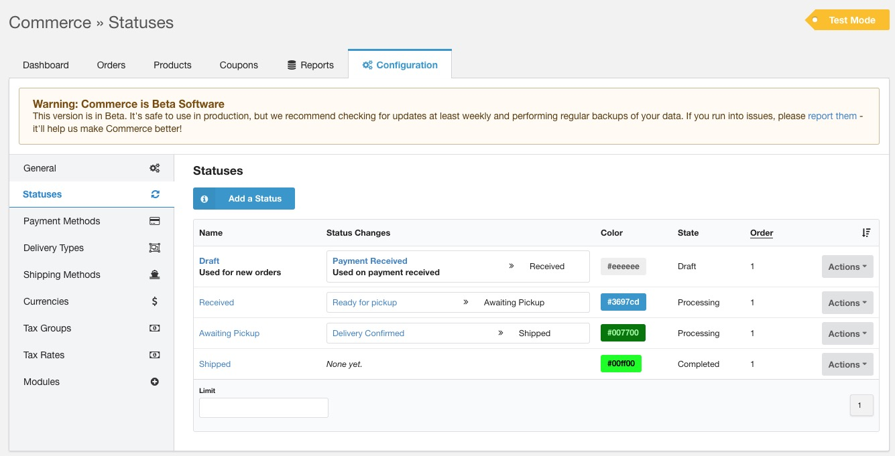
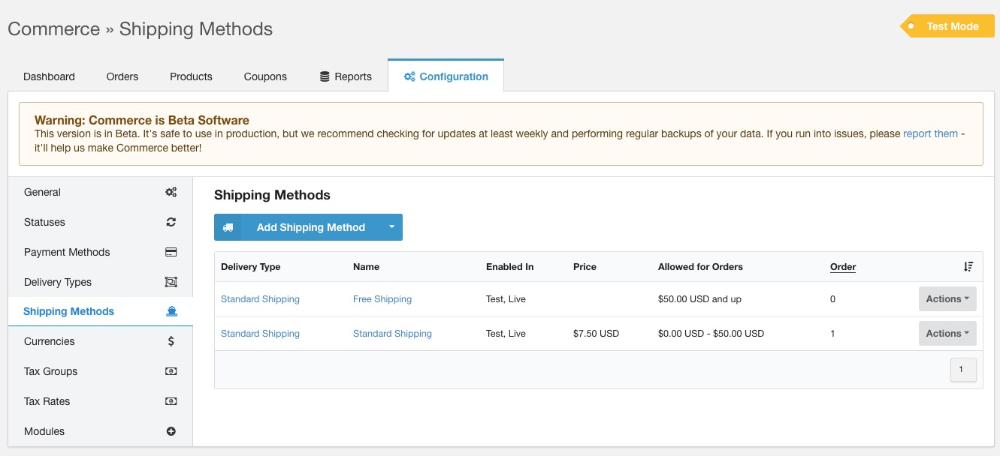
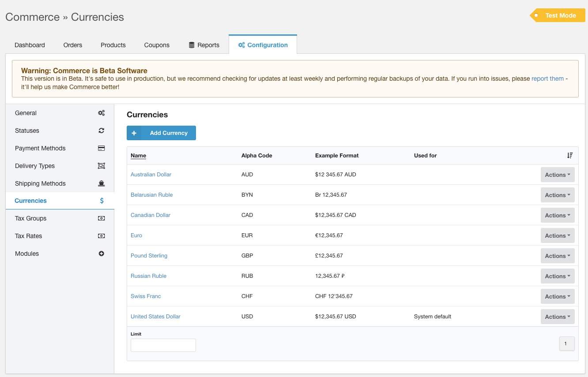

_This document assumes [Commerce was downloaded and installed with the default options](index)._

On this page:

[TOC]

## The Commerce Dashboard

Whenever we talk about the Commerce Dashboard, we mean Extras &raquo; Commerce in your MODX Manager. This section of your MODX installation contains the configuration, products, reporting and more. 

## Choosing Modules to use

One of the first things you should do is decide whatmodules you want to use. In Commerce, many features are implemented as optional modules that can be enabled/disabled at will, and may contain additional configuration options.

The majority of modules ship with the Commerce core, but [additional extensions](https://www.modmore.com/commerce/extensions/) are also available from modmore or third parties.
 
In the Commerce Dashboard, navigate to Configuration &raquo; Modules to take a look at the modules that are available. 

To enable and configure a module, click its name in the list. You can enable modules in either test, live, or both modes by checking the appropriate boxes. 

Which modules you'll use depend on the type of shop and how you want to run things. We'll highlight a couple here. 

Note that the names are translated, so if you use the manager in a different language than English they will be named differently and may be in a different order. 

### Customer, Address, and Shipping related

We **strongly recommended** to enable the [Basic Address Validation](../50_Modules/Address_Validation/Basic) module. This module ensures that address information is filled in before the customer can move along in the checkout. In the module configuration you can enter the fields that should be required, depending on your locality, the `state` field may be best taken out. 

You should also enable either [Autofill GeoIP](../50_Modules/Cart/AutoFillGeoIP) or the [Default Address](../50_Modules/Cart/DefaultAddress) module. These modules will set an expected address on the order before the customer gets to the address step, which is used by your taxes and shipping configuration to determine what rates and options to show in the cart. 

- The Default Address module is useful if you serve a distinct demographic; for example if you only (or predominantly) ship to one country or state, you can configure the Default Address module to use that by default, which should be accurate for the majority of your customers.
- If your customer-base is more spread out, the Autofill GeoIP module will automatically geolocate the customer by their IP address and use the country (and optionally state) instead. This uses the [ipinfo.io](https://ipinfo.io/) service (free for up to 1000 lookups per day). 

If you only sell in specific countries, the [Country Validation](../50_Modules/Address_Validation/Country) module is useful to restrict that.

### Discounts

You'll likely want to enable the [Coupons](../50_Modules/Discounts/Coupons) module to get access to coupon codes. After enabling the module, refresh the page to see the Coupons tab being added to the top navigation.

### Taxes

- If you sell to customers in the European Union, enable the [EU VAT](../50_Modules/Taxes/EUVat) module to enable the EU VAT Rate Provider that enables automatically up-to-date tax rates across all countries in the EU. 
- If you sell to customers in the United States, the [TaxJar](../50_Modules/Taxes/TaxJar) module can be used to get automated sales tax calculations. 

We'll look at configuring the actual [tax rates](../Taxes) in the next sections.

### Products & Cart

Enable [CombineProducts](../50_Modules/Cart/CombineProducts) if you want multiple items with the same product to be combined into a single item in the cart. Note that this is not compatible with [ItemData](../50_Modules/Cart/ItemData) which we'll discuss later.

## Setting up Statuses

The default installation created a simple status workflow for you. In Configuration > Statuses you can see that in action.

For now, we'll leave that as-is, but later on you may want to change the emails that get send when an order is paid. Click on "Payment Received" in the Status Changes column for Draft to see the actions that are fired when the payment is received. 

You'll see two email actions are configured here, a confirmation email to the customer, and the order notification to the merchant. By clicking on the name (or "Edit Status Change Action" in the Actions menu), you can see the subject, recipient, and content configuration for each. By default these use templates, but you may need to tweak the recipient email on the order notification to merchant. 

## Setting up Payment Methods

In the installation, a "Dummy Payment" was automatically created. This uses the [manual payment gateway](../Payment_Methods/Manual) which just marks the order as paid. If you want to add other payment method options, you can do that at Configuration > Payment Methods.

## Setting up Delivery Types & Shipping Methods

Depending on what you will be selling, you may or may not need to tweak the delivery types in Configuration > Delivery Types. For basic shops where every sold product fits in the same type of box or is distributed digitally in the same way, you will only need a single delivery delivery type.

If you have different types of products, for example a combination of ebooks and physical books, you'll need to create an additional delivery type. 

It's best to set up delivery types for distinct ways of getting the customer their order. While you'll create a delivery type for an ebook and another one for a physical books, you wont typically need a different delivery type if you also sell t-shirts, as those are delivered the same way as a book.

For now, we'll only use the default "Standard Shipping" delivery type. You can edit the delivery type to make the shipping step required or never shown, depending on your requirements. In the default shipping step mode of "Depends", the shipping step is only shown in the checkout if there are 2 or more shipping methods available for an order.

Next, go to Configuration > Shipping Methods. You'll have a free shipping method already from the installation, that's assigned to the Standard Shipping delivery type we just saw in Configuration > Delivery Types.

If you created extra delivery types, you'll also need to create additional shipping methods for each. 

To help with testing, you can choose to set the Free Shipping method to a minimum order total of €50 by editing it (click on its name in the grid) and setting "Min. Order Total" at the bottom to 5000 ($50). And then create another shipping method of type "Standard Shipping Method" that costs $7,50 for orders with a "Max. Order Total" of 5000 ($50).

_&raquo; Tip:_ Prices in Commerce are configured in cents, but you'll see the formatted price when you remove focus from the field. 

## Setting up Currencies

The most common currencies for modmore customers will have already been created for you in the installation, but if you want to change the formatting or decide which one is used, head over to Configuration > Currencies. 

Click on the currency name or choose Edit Currency in the actions menu to change the formatting options. In the Actions menu you can also choose _Set as Default_ to change the default currency. 

For Euro, some countries prefer to use the comma instead of the dot for the decimal separator. Click on Euro and switch out the values for "Decimal Point" and "Thousands Separator" to tweak that.

If you need to add a currency that is not included in Commerce by default, [this site has a comprehensive list of the ISO4217 codes and formatting to use](https://www.thefinancials.com/Default.aspx?SubSectionID=curformat). 

[Learn more about currencies here](../Currencies). 

## Setting up Tax Groups

Next up, create a tax group under Configuration > Tax Groups. Give it a name that describes the **type** of tax, not the actual rate to charge. For example you could have "Standard" and "Food", but you should not name them "21%" or "9%". 

After creating the tax group, choose Manage Tax Rules in the Actions menu. 

What the tax rules should be exactly depends on your jurisdiction and what you're selling, and to two. In many cases there is a tax rate that applies to local customers, and one (or more) for international customers. [The taxes documentation](../Taxes) explains in more detail how you can configure different rates and rules, but for now let's keep it simple, and add a simple singular tax rate that applies to every purchase.

Click Add Tax Rule. Give it a priority of 1, set "Field name" to "country", and "Condition" to "Always". Leave the Rate Provider set to Manual Tax Rate. 

When you save the tax rule, a new section "Rate Provider Options" will be shown. Enter the tax rate you want to charge, for example 21, give it a Tax Key like "STANDARD-NL", and a name that is shown to customers like "21% VAT" or "Standard VAT". Save again. 

(If you want to add more tax rules, repeat this process. The priority determines in what order the tax rules will be evaluated, from top-to-bottom in the grid, so set the conditions so that the lowest priority number is the most specific, and eventually fall back to an "Always" condition with the highest priority number.)

## Some final System Settings

Now that you've explored all parts of the configuration in the Commerce Dashboard, there are a few more system settings you may want to consider tweaking. These can be found by going to System (cog icon in the manager) > System Settings, and choosing "Commerce" in the first filter (namespace). 

- There are some settings related to the account step in the checkout. [Read more about how to configure them for what result in the Users documentation](../Users)
- The `commerce.default_weight_unit` setting is useful to configure before creating products. It defaults to `kg`, but virtually all weight units are supported. 
- Don't want to see the beta warning? Disable `commerce.show_beta_warning`. 
- The E-mail & Notifications settings are useful to configure some default email options, like an image to use as image header with `commerce.email_header_url`. 
- In the Taxes area, set the `commerce.tax_calculation` to `inclusive` if you want product prices to be treated as having taxes included in them, instead of adding taxes on top of it. 

## Up next: set up your Product Catalog

Now that the most important configuration is in place, it's time to start [setting up your products](Product_Catalog)!

