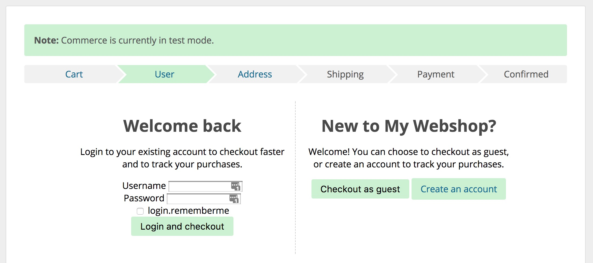

_This document assumes [Commerce was downloaded and installed with the default options](index), that [you've gone through the basic configuration](Configuration), and [started building your Product Catalog to the point of having a functional add-to-cart form](Product_Catalog)._

At this point you should have added your first product to the cart. Congrats! 

Now we're going to start changing the cart and checkout to fit your shop. There's a lot you can do, some which will require more technical skills than others, so we'll go over a few common things to do. 

It's important to note that, technically speaking, the cart and checkout are part of the same system. That's why you'll also see cart shown as a step in the checkout.

[TOC]

## Exploring the Checkout Steps

By default, Commerce shows all of the following steps:

- **Cart**, usually on a separate page, where the customer manages the items they're buying, can add coupon codes, and chooses to checkout
- **Account**, offers the customer to either login or to continue as a guest
- **Address**, asks the customer to enter their shipping and billing address information.
- **Shipping**, asks the customer to choose a shipping method
- **Payment**, requests payment from the customer
- **Thank you**, confirms the order was paid and the order is complete

It's not currently supported* to change the order or functionality of these steps drastically, but there are various ways to make this fit your shop. We'll go over those options for each step.

* Technically, it _is_ possible to change the checkout steps, but that requires in-depth technical knowledge of Commerce and changing undocumented features. That's why we do not currently provide support for it and discourage going down that route as we may still change how that works to make future customisation easier which would break custom checkout processes.

### Cart 

The cart step is always present. It's how you can add items to an order, and where the customer can make changes. With the Coupons module enabled, this also has the form to validate a coupon code. 

The cart is usually on its own resource (identified by the `commerce.cart_resource` system setting), which the Commerce installation will have created for you. You can change the MODX template and presentation of this page to your liking. 

Further customisation to the cart usually revolves around changing the design or templates; we'll get to how that works in a minute.

### Account

The account step is optional, shown by default. 

If the customer visiting this step is already logged in, the customer will be immediately redirected to the next step. 

If the customer is not logged in, there are 2 options shown. There's a simple login form ([which you'll need to set up to work with the Login snippet](../Users/Login_Resource) as that's not done automatically for you) and a link to a [registration page](../Users/Register_Resource), and a button that lets the customer continue as a guest, without an account.

Other use cases for the account step are possible just by changing a few system settings:

- To always require a user to be logged in, set the `commerce.checkout_requires_account` system setting to yes. This will replace the block to continue as guest with a notice that an account is required.

- To skip the account step completely, set both the `commerce.checkout_requires_account` and `commerce.checkout_show_account_step` settings to `no`. The account step will be removed from checkout completely. 

### Address

The address step is required. It's where the customer enters their shipping (and optionally billing) address. If the customer is logged in, the address step may show previously used addresses as an option to speed along the process. 

### Shipping

The shipping step is optional. When shown, it will calculate how much it costs to ship with each of your configured [shipping methods](../Shipping_Methods), show them in a list, and ask the customer to choose. If there are products from multiple [delivery types](../Delivery_Types) in the order, the customer will be asked to choose a shipping method for each. 

Commerce automatically selects the first available shipping method as soon as the cart, to present the user with an accurate total as soon as possible. 

On each delivery type you can choose what to do with the shipping step:

- By default, the shipping step is set to "depends", which means it will only be shown if there is more than one matching shipping method for the order. 
- When you set the shipping step to "required" on the delivery type, the shipping step is always shown, even with just one matching shipping method that has been pre-selected.
- When you set the shipping step to "never", it is always hidden, and the customer cannot change the shipping method from the pre-selected one.

### Payment

The payment step is required. It lists available payment methods, including the calculated fee if set.

If the order total is zero because of a coupon, or all products being free, then the payment step is automatically skipped and the order marked as completed. 

If the total is not zero, but you do not intend to use online payments, you can create a payment method with the [Manual payment gateway](../Payment_Methods/Manual). That will mark the order as paid without the customer actually paying.

### Thank you

When the customer visits the thank you page, the order is completed and their cart is emptied for future orders. 

## Design & templates

See [theming](../Front-end_Theming) for how to change the front-end templates and design.

## Next

When you have your shop functional, let's end this tutorial with some notes about [extending Commerce](Extending_Commerce).

