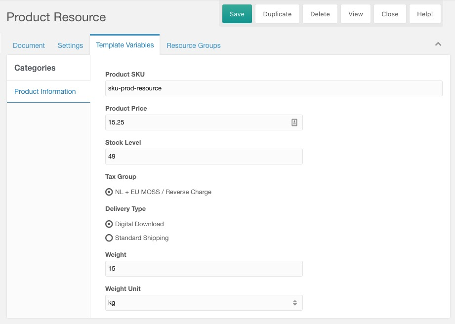

Resource product types allow you to manage product information with resources representing products. Information like name, price, and stock, are stored in standard resource fields or template variables.

The resource product type is most useful if you have an existing catalog, and want to add the ability to purchase products that are already managed as resources.

The biggest downside of using resource products is that you can only have a single product (so no variations) per page. The [Products TV](../Product_Catalog/Products_TV) is more flexible from that point of view.

## Pros 

- Easy to integrate into templates with its use of TVs
- Fairly flexible - you can associate more data with the product
- Easy to add to an existing site that already has resources

## Cons

- One resource = one product, with no variations
- Having tons of resources is not ideal if they don't also serve an existing function for browsing products. 

## Setup

[See the setup instructions under Product Catalog > Resource.](../Product_Catalog/Resource)

## Add to Cart form

You can use any of the [add to cart forms](../Product_Catalog/Add_to_Cart_Form) with resource products as well. It's recommended to use the [commerce.get_resource_product_id snippet](../Snippets/get_resource_product_id) to get the product ID to use in the form, as well as to create the resource products automatically if they don't already exist. 
